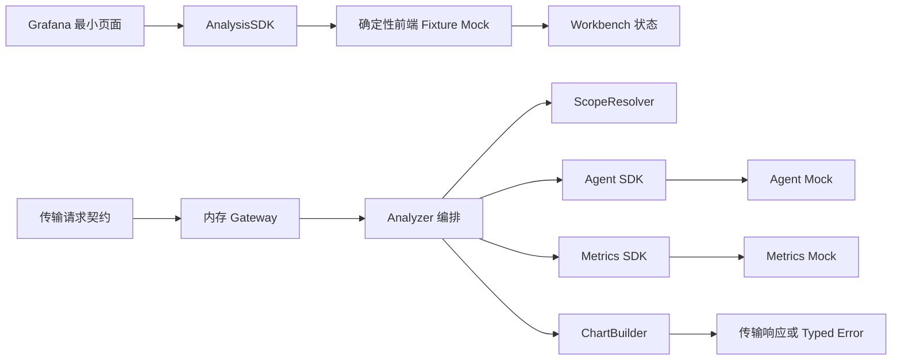

# Torchbearing MS1 实现说明

> 更新日期：2026-07-13  
> 状态：成员 A～E 的 MS1 代码已完成，当前交付为可编译、可测试、可通过确定性 mock 串联的 MVP 骨架。

## 1. 文档目的

本文档说明 MS1 阶段实际新增的功能、代码结构、模块边界、SDK 契约、确定性 mock、测试覆盖和遗留问题，供后续联调、Review 和里程碑验收使用。

需求和技术决策仍以以下文档为准：

- [`exclude/软件工程规范.md`](../exclude/软件工程规范.md)
- [`exclude/架构设计规范.md`](../exclude/架构设计规范.md)
- [`exclude/产品设计规范.md`](../exclude/产品设计规范.md)
- [`exclude/proposals/`](../exclude/proposals/)

本文档不替代上述规范；若描述冲突，以硬性规范为准。

## 2. MS1 已实现范围

本阶段已经实现：

- 稳定的分析请求、响应、图表和错误契约。
- 后端核心领域类型及模块接口。
- Agent SDK 和 Metrics SDK abstraction。
- 分析范围的规范化与确定性校验。
- Agent、Metrics、Clock、ID Generator 的 deterministic mock/in-memory adapter。
- 指标结果到图表定义的确定性转换。
- MS1 分析编排服务、依赖组装和内存传输网关。
- 确定性命令行演示入口。
- 前端 Analysis SDK mock、Scope 模型和 Workbench 状态模型。
- 最小 Grafana AppPlugin 页面入口。
- 契约测试、模块测试和完整主流程集成测试。

本阶段没有实现：

- 真实 HTTP/RPC 服务。
- 真实 Grafana、Prometheus、LLM、MCP 或第三方 API 访问。
- 数据库、消息队列、对象存储或持久化。
- 多轮会话、流式输出、Skills、知识库、Playbook、告警自动分析等后续能力。
- MS2～MS4 的真实数据对接、功能闭合和发布部署能力。

## 3. 主流程



前端和后端在 MS1 通过同一组稳定契约与 fixtures 对齐。当前不建立真实网络连接：前端使用 fixture mock，后端使用内存网关和 Go mock adapters。

## 4. 成员分工与交付

| 成员 | 主要职责 | 主要目录/文件 | 已交付能力 |
|---|---|---|---|
| A | 公共契约、核心抽象、SDK | `contracts/`、`internal/core/`、`internal/contracts/`、`sdk/`、`plugin/src/contracts/`、`plugin/src/sdk/` | 强类型请求/响应/错误、核心 ports、前后端 SDK、契约 fixtures 与测试 |
| B | Scope 模块 | `internal/scope/` | datasource/time range 规范化、范围校验、typed error |
| C | 确定性 adapters 与图表构建 | `mocks/`、`internal/chart/` | Agent/Metrics mock、固定 Clock/ID、成功/空/失败/边界数据、ChartBuilder |
| D | 前端 mock 和 Workbench | `plugin/src/mocks/`、`plugin/src/features/` | fixture SDK、Scope 表单模型、Workbench 状态模型及测试 |
| E | 编排、入口和集成 | `internal/analysis/`、`internal/bootstrap/`、`internal/transport/`、`cmd/`、`tests/integration/`、`plugin/src/module.tsx` | 后端主流程、内存网关、CLI、Grafana 入口、端到端 mock 集成测试 |

## 5. 代码结构

```text
.
├── cmd/torchbearing/                  # 确定性 MS1 命令入口
├── contracts/
│   ├── analysis.schema.json           # 分析契约 JSON Schema
│   ├── error.schema.json              # 错误契约 JSON Schema
│   └── fixtures/                      # 成功、空数据、失败和边界 fixtures
├── internal/
│   ├── analysis/                      # MS1 主流程编排
│   ├── bootstrap/                     # 确定性依赖组装
│   ├── chart/                         # MetricResult → ChartSpec
│   ├── contracts/                     # Go 传输 DTO
│   ├── core/                          # 领域类型、错误和 ports
│   ├── scope/                         # 分析范围解析与校验
│   └── transport/grafana/             # 无网络的强类型内存网关
├── mocks/
│   ├── agent/                         # Agent SDK mock
│   ├── deterministic/                 # 场景、固定时钟、确定性 ID
│   └── metrics/                       # Metrics SDK mock
├── plugin/src/
│   ├── contracts/                     # TypeScript 请求/响应/错误类型
│   ├── features/analysis/             # Workbench 状态模型
│   ├── features/scope/                # Scope 表单模型
│   ├── mocks/                         # Fixture 驱动的 AnalysisSDK mock
│   ├── sdk/                           # 前端 AnalysisSDK 接口
│   └── module.tsx                     # 最小 Grafana AppPlugin 入口
├── sdk/
│   ├── agent/                         # Agent Client 接口
│   └── metrics/                       # Metrics Client 接口
└── tests/
    ├── contract/                      # Schema、fixture、SDK 契约测试
    └── integration/                   # 完整 MS1 mock 主流程测试
```

## 6. 核心契约

### 6.1 分析请求

```text
AnalysisRequest
├── text: string
└── scope
    ├── datasourceUid: string
    └── timeRange
        ├── from: string
        └── to: string
```

示例：

```json
{
  "text": "查看 checkout 服务过去 30 分钟的请求速率",
  "scope": {
    "datasourceUid": "prometheus-mock",
    "timeRange": {
      "from": "now-30m",
      "to": "now"
    }
  }
}
```

### 6.2 分析响应

```text
AnalysisResponse
├── requestId: string
├── message: string
├── charts: ChartSpec[]
└── mock: true
```

`ChartSpec` 当前包含：

- 图表 ID、标题和类型。
- datasource UID。
- PromQL。
- 时间范围。

### 6.3 Typed Error

```text
ErrorResponse
├── code: ErrorCode
├── message: string
├── retryable: boolean
└── requestId: string
```

已定义错误码：

- `INVALID_ARGUMENT`
- `INVALID_SCOPE`
- `AGENT_UNAVAILABLE`
- `METRICS_UNAVAILABLE`
- `NO_DATA`
- `INTERNAL`

### 6.4 SDK/Port

后端接口：

```go
type Client interface {
    Plan(ctx context.Context, request core.AgentRequest) (core.AnalysisPlan, error)
}

type Client interface {
    Query(ctx context.Context, query core.MetricQuery) (core.MetricResult, error)
}

type ScopeResolver interface {
    Resolve(ctx context.Context, scope AnalysisScope) (AnalysisContext, error)
}

type ChartBuilder interface {
    Build(plan AnalysisPlan, result MetricResult) ([]ChartSpec, error)
}

type Analyzer interface {
    Analyze(ctx context.Context, request AnalysisRequest) (AnalysisResponse, error)
}
```

前端接口：

```ts
export interface AnalysisSDK {
  analyze(request: AnalysisRequest): Promise<AnalysisResponse>;
}
```

## 7. 各模块行为

### 7.1 Scope Resolver

- 去除 datasource UID 和时间范围首尾空白。
- 校验 datasource、开始时间和结束时间非空。
- 支持比较 RFC3339 时间。
- 支持比较 `now±数字{s|m|h|d|w}`。
- 开始时间晚于结束时间时返回 `INVALID_SCOPE`。
- 对其他非空 Grafana 时间表达式保持不透明，不擅自改写。

### 7.2 Agent Mock

- 实现 `sdk/agent.Client`。
- 成功场景返回固定 checkout PromQL 和图表意图。
- 空结果场景生成 unknown-service 查询。
- Agent 失败场景返回 retryable `AGENT_UNAVAILABLE`。
- 边界场景返回固定 stat 图表计划。

### 7.3 Metrics Mock

- 实现 `sdk/metrics.Client`。
- 成功场景返回固定三点序列。
- 空结果场景返回 `DataStateEmpty` 和非 nil 空切片。
- 失败场景返回 retryable `METRICS_UNAVAILABLE`。
- 边界场景返回单点零值序列。

### 7.4 Chart Builder

- `DataStateEmpty` 转换为空 `ChartSpec` 列表。
- `DataStatePresent` 转换为一个稳定的 renderer-neutral `ChartSpec`。
- present 状态但没有 series 时返回 `NO_DATA`。
- 拒绝未知图表类型和不完整查询。

### 7.5 Analysis Service

编排顺序固定为：

1. 生成 request ID。
2. 校验分析文本。
3. 调用 `ScopeResolver`。
4. 调用 Agent SDK。
5. 调用 Metrics SDK。
6. 调用 `ChartBuilder`。
7. 返回 typed success/error。

任一步失败都会停止下游调用，并给错误补充 request ID。

### 7.6 前端 Workbench

Workbench 状态包括：

- `idle`
- `loading`
- `success`
- `empty`
- `error`

Workbench 只依赖 `AnalysisSDK`，不会直接访问 Go 模块或内部 mock 实现。

## 8. 确定性场景矩阵

| 场景 | Request ID | Agent | Metrics | 图表/错误 |
|---|---|---|---|---|
| 成功 | `mock-analysis-001` | 固定 checkout 计划 | 固定三点序列 | 1 个 timeseries |
| 空结果 | `mock-analysis-002` | 固定 unknown-service 计划 | `DataStateEmpty` | 空图表数组 |
| Agent 失败 | `mock-analysis-003` | `AGENT_UNAVAILABLE` | 不调用 | retryable error |
| Metrics 失败 | `mock-analysis-004` | 固定 checkout 计划 | `METRICS_UNAVAILABLE` | retryable error |
| 单点边界 | `mock-analysis-005` | 固定 stat 计划 | 单点零值序列 | 1 个 stat |
| 无效范围边界 | `mock-analysis-005` | 不调用 | 不调用 | `INVALID_SCOPE` |

所有 mock 都不使用随机数、当前系统时间或真实外部数据。

## 9. 运行与验证

### 9.1 Go 完整验证

```bash
go test ./...
go vet ./...
go build ./...
```

### 9.2 运行确定性演示

```bash
go run ./cmd/torchbearing
```

该命令输出与 `contracts/fixtures/success.json` 对齐的成功响应。

### 9.3 前端验证

当前 TypeScript 严格类型检查和临时 emit build 已通过。仓库尚未生成可用 lockfile，也没有 `plugin/node_modules`，因此以下配置命令目前不能在本工作树直接执行：

```bash
cd plugin
npm run format:check
npm run lint
npm run build
npm run test:ci
```

在 manifest owner 完成依赖锁定和安装后，应重新执行上述四项作为正式前端验收。

## 10. 当前测试覆盖

- JSON Schema 语法检查。
- 五份公共 fixture 的结构与固定字段检查。
- Go/TypeScript SDK 契约检查。
- Typed error 字段、复制语义和错误链检查。
- Scope 成功、空输入、失败、取消及边界测试。
- Agent/Metrics mock 成功、空结果、失败和边界测试。
- ChartBuilder 成功、空结果、失败和边界测试。
- 前端 SDK、Scope Model 和 Workbench 状态测试。
- CLI 确定性输出测试。
- 后端完整 MS1 主流程集成测试。
- E 前端入口使用确定性 `AnalysisSDK` 的加载检查。

最近一次完整验证结果：

- `go test ./...`：通过。
- `go vet ./...`：通过。
- `go build ./...`：通过。
- E 相关 Go race test：通过。
- TypeScript strict/typecheck：通过。
- D 的 12 项前端场景测试：通过。

## 11. 已知问题与后续集成事项

### 11.1 ChartSpec 不携带指标点位

当前 `ChartSpec` 只有图表元信息和 PromQL，没有 C 生成的 `MetricResult.Series`。前端目前只能展示标题、图表类型和查询语句，无法仅根据 `AnalysisResponse` 绘制固定数据点。

建议由契约 owner 决定是否以向后兼容方式增加可选 `ChartData` 或 `series` 字段。

### 11.2 Grafana backend 元数据与当前实现不一致

`plugin/plugin.json` 当前声明：

- `backend: true`
- `executable: gpx_torchbearing`

当前 MS1 只实现了内存网关和 `cmd/torchbearing` 演示入口，没有生成 `gpx_torchbearing` Grafana backend binary。正式加载插件前，需要由 manifest owner 决定：

- MS1 暂时关闭 backend；或
- 增加与 metadata 一致的 backend 构建目标。

### 11.3 前端依赖尚未锁定

当前缺少可用的 `plugin/package-lock.json` 和 `plugin/node_modules`，正式 webpack、Jest、ESLint 和 Prettier 验收尚未完成。

### 11.4 当前不是生产实现

当前场景通过 composition-time scenario 选择，并使用固定 request ID、固定时间和固定数据。它只用于 MS1 骨架和验收，不应当作为真实环境 adapter。

## 12. MS1 完成定义

当前代码满足以下 MS1 骨架目标：

- 模块边界和 owner 清晰。
- 关键请求、响应、错误及 SDK 契约已经代码化。
- 包依赖保持单向，无循环依赖。
- 后端主模块可以通过 mock 完整串联。
- 前端通过 SDK 和 fixtures 完成契约级串联。
- 成功、空结果、失败和边界场景均可稳定复现。
- 代码可编译，后端完整测试集通过。
- 没有真实外部系统连接，也没有提前实现 MS2～MS4。

前端依赖锁定、真实 Grafana 构建验证以及上述共享契约问题处理完成后，才可视为完整的可发布集成版本。
