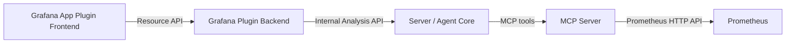
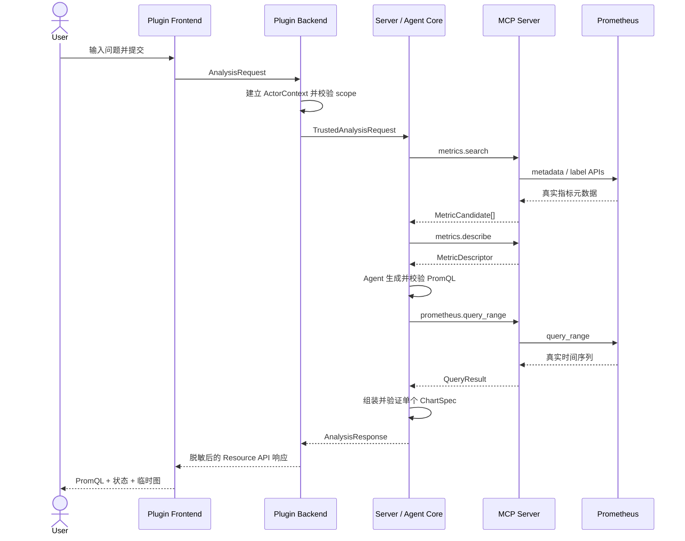
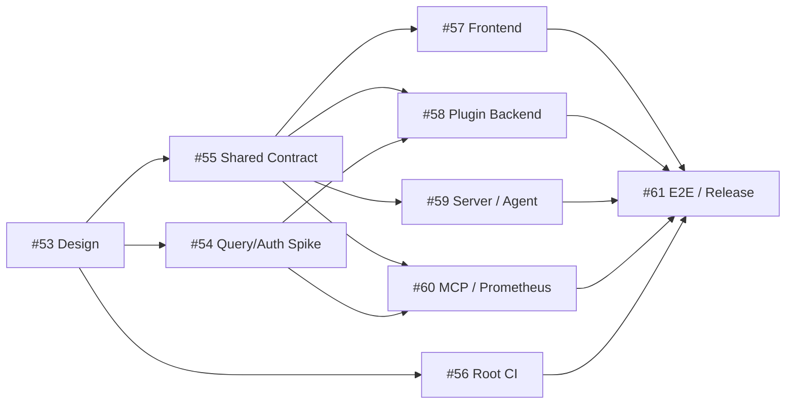

# MS1 真实 Prometheus 单图主链设计

关联产品提案：#52
关联设计 Issue：#53

本文是设计草案 PR 的逐行评审载体。评审定稿后，最终结论回填 #53；本文件所在 PR 不合并。

## 1. 设计目标

实现以下唯一主链：

```text
Grafana 中的自然语言问题
→ 选择受控的真实 Prometheus 数据源和时间范围
→ Agent 发现真实指标并生成 PromQL
→ MCP Server 执行真实只读查询
→ 返回查询证据和一张临时图
```

设计必须满足：

- 三个运行单元职责稳定，能够由不同成员并行实现；
- 图表数据只能来自真实 Prometheus 查询，Agent 不能生成或补造数据；
- PromQL、数据源、时间范围、执行状态和失败原因对用户透明；
- 浏览器身份字段、模型输出和 MCP 工具参数不能扩大权限；
- MS1 不引入多轮、持久化、多图、Dashboard 写入和其他数据源；
- 当前代码中的空 Module 和目录不能被当作功能已经完成。

## 2. 当前代码事实

设计只使用同步代码分支中的事实：

- 仓库包含 `grafana-plugin-app/`、`server/`、`mcp-server/` 和 `api/`；
- 根 `go.work` 聚合四个 Go Module；
- Grafana App Plugin 包含生成器提供的 Frontend、Plugin Backend、测试和构建配置；
- Plugin Backend 只有示例 `ping`、`echo` Resource Handler；
- Server、MCP Server 和公共 API 尚无可运行主链；
- 插件名称、插件 ID 和部分 Go Module path 仍是模板或个人路径；
- 仓库根目录没有能够验证三单元主链的 CI。

因此，本 Design 不把目录存在、`.gitkeep`、生成器页面或空 Module 视为架构完成。

## 3. 核心决策

### 3.1 三个独立运行单元



- Grafana App Plugin 是一个交付单元，内部包含 Frontend 和 Plugin Backend；
- Server 是独立交付单元，Agent Core 只存在于 Server；
- MCP Server 是普通 MCP Server，只暴露受控的只读观测工具；
- `api/` 是跨 Go 单元共享的契约 Module，不是第四个运行单元。

不把 Agent 放入 Plugin Backend，也不让 Frontend 直连 Server、MCP Server、模型或 Prometheus。

### 3.2 MS1 使用同步单次分析，不引入会话协议

Frontend 通过一次 Resource API 请求发起分析，最终得到一个成功、需要补充、无数据或失败响应。

MS1 不定义 Conversation、Turn、Message、SSE 重连和跨请求上下文。实现可以展示本地加载状态，但流式对话不是本期契约。

如果信息不足，Server 返回 `needs_input` 和候选项。用户补充后发起新的独立请求；服务端不保存上一请求。

### 3.3 Agent 只生成查询计划，不生成查询数据

Agent Core 可以：

- 理解用户问题；
- 选择候选指标；
- 生成 PromQL；
- 根据受控错误修正一次查询；
- 生成图表标题和说明。

Agent Core 不可以：

- 生成时间序列样本；
- 把示例数据写入成功响应；
- 自报用户、组织、数据源权限或 Prometheus 地址；
- 在没有真实 QueryResult 时返回成功图表。

最终 `series`、查询耗时、序列数和查询状态必须由 MCP Server 的真实查询结果产生。

### 3.4 MCP Server 拥有只读观测工具

MS1 只定义三个工具：

| 工具 | 输入 | 输出 | 副作用 |
|---|---|---|---|
| `metrics.search` | 数据源引用、搜索文本、限制 | 真实指标候选 | 无 |
| `metrics.describe` | 数据源引用、指标名 | 类型、Help、标签名 | 无 |
| `prometheus.query_range` | 数据源引用、PromQL、时间范围、step | 受限时间序列 | 无 |

不把 `generate_promql`、`generate_chart`、Dashboard 写入、Skill、Playbook 或任意脚本执行注册为 MS1 工具。

### 3.5 数据源使用服务端引用，不传递凭据

Frontend 只提交公开的 `datasourceUid`。Plugin Backend 将它解析为管理员配置的 `DatasourceRef`，并在可信上下文中交给 Server。MCP Server 再通过服务端配置把 `DatasourceRef` 映射到真实 Prometheus endpoint 和只读凭据。

以下内容禁止进入浏览器响应、模型上下文和 MCP 工具参数：

- Grafana Cookie、Authorization header；
- Prometheus 用户名、密码、Token；
- Plugin、Server 和 MCP Server 之间的服务凭据；
- 未脱敏的内部错误响应。

MS1 的最低授权语义是：已登录 Actor 同时满足组织/角色策略，并且数据源存在于插件允许列表。它不自动等于 Grafana 的细粒度 datasource RBAC。正式实现前必须由本流程自己的 Spike 验证实际查询路径和权限语义；如果无法证明请求不会扩大用户权限，应停止相关实现并调整 Proposal 或查询路径。

### 3.6 跨单元契约先稳定，再并行实现

公共 Go 契约位于 `api/`，只包含 MS1 真实消费者需要的类型和错误，不预建 Session、Knowledge、Skill、Playbook、Snapshot、Publication、Webhook 等未来领域包。

Frontend 在 `grafana-plugin-app/src/api/` 提供业务语义 SDK，例如：

```typescript
analysisApi.analyze(request)
```

Frontend 不在页面中直接拼 Resource URL。Go 与 TypeScript 通过共享 JSON 样例和契约测试校验 wire format；MS1 不引入完整代码生成工具链。

## 4. 职责与禁止依赖

### 4.1 Grafana App Plugin Frontend

负责：

- 收集自然语言、数据源和 Grafana 时间范围；
- 通过类型化 SDK 调用 Plugin Backend；
- 展示加载、需要补充、成功、无数据和失败状态；
- 展示 PromQL、数据源、时间范围和查询状态；
- 使用真实返回的 series 渲染一张临时图。

不负责：

- 确认用户身份和最终权限；
- 直连 Server、MCP Server、模型或 Prometheus；
- 保存图表、会话或 Dashboard；
- 生成成功数据兜底。

### 4.2 Grafana Plugin Backend

负责：

- 从可信 Plugin Context 建立最小 ActorContext；
- 忽略请求体中的用户、角色、组织等自报字段；
- 校验请求大小、时间范围和 datasource allowlist；
- 使用内部服务身份调用 Server；
- 传播 request ID、取消和超时；
- 将内部错误映射为稳定且脱敏的 Resource API 响应。

不负责 Agent 推理和 PromQL 生成，也不直接拼装成功 ChartSpec。

### 4.3 Server / Agent Core

负责：

- 校验内部调用身份和可信 ActorContext；
- 组织指标搜索、指标说明、PromQL 生成和真实查询；
- 限制 Agent 工具白名单、调用次数和总预算；
- 对 PromQL、QueryResult 和 ChartSpec 执行结构与策略校验；
- 只在收到真实 QueryResult 后组装成功响应；
- 信息不足时返回候选和 `needs_input`。

Agent 框架和模型供应商封装在内部适配器后，不进入公共协议。

### 4.4 MCP Server

负责：

- 提供三个只读 MCP 工具；
- 校验 tool schema 和服务调用身份；
- 根据服务端配置解析 DatasourceRef；
- 调用真实 Prometheus metadata、labels 和 query_range API；
- 执行超时、时间范围、候选数、序列数和样本数限制；
- 返回结构化、限量、脱敏结果。

不接收完整自然语言问题和聊天历史，不负责 Agent 编排，也不持久化查询结果。

## 5. 运行主链



任意一跳失败都必须返回真实失败状态，不能由上层伪造成功结果。

## 6. 公共信息结构

### 6.1 请求

```go
type AnalysisRequest struct {
    Question      string    `json:"question"`
    DatasourceUID string    `json:"datasourceUid"`
    TimeRange     TimeRange `json:"timeRange"`
}

type TimeRange struct {
    From time.Time `json:"from"`
    To   time.Time `json:"to"`
}
```

浏览器请求中不存在 Actor、Role、OrgID、Prometheus endpoint 和任何凭据字段。

### 6.2 可信内部上下文

```go
type ActorContext struct {
    OrgID string
    Login string
    Role  string
}

type DatasourceRef struct {
    UID string
}
```

内部上下文由 Plugin Backend 建立，并通过服务间认证保护。Agent 只能读取必要摘要，不能修改。

### 6.3 响应

```go
type AnalysisResponse struct {
    RequestID string         `json:"requestId"`
    Status    AnalysisStatus `json:"status"`
    Query     *QueryEvidence `json:"query,omitempty"`
    Chart     *ChartSpec     `json:"chart,omitempty"`
    Prompt    *InputPrompt   `json:"prompt,omitempty"`
    Error     *PublicError   `json:"error,omitempty"`
}
```

允许状态：

- `success`：必须同时存在真实 QueryEvidence 和单个 ChartSpec；
- `needs_input`：只有补充问题和受控候选，不存在 ChartSpec；
- `no_data`：保留已执行 PromQL 和时间范围，不存在伪造 series；
- `error`：包含稳定错误码和安全消息。

### 6.4 查询证据和临时图

```go
type QueryEvidence struct {
    Language     string    `json:"language"`
    Expression   string    `json:"expression"`
    DatasourceUID string   `json:"datasourceUid"`
    TimeRange    TimeRange `json:"timeRange"`
    DurationMS   int64     `json:"durationMs"`
    SeriesCount  int       `json:"seriesCount"`
    Metrics      []string  `json:"metrics"`
}

type ChartSpec struct {
    Title  string   `json:"title"`
    Type   string   `json:"type"`
    Unit   string   `json:"unit,omitempty"`
    Legend string   `json:"legend,omitempty"`
    Series []Series `json:"series"`
}
```

MS1 的 `ChartSpec.Type` 只允许 `timeseries`。未来增加其他图表类型需要新的产品或设计增量。

## 7. 错误边界

| 错误码 | 含义 | 用户行为 |
|---|---|---|
| `INVALID_REQUEST` | 问题、数据源或时间范围无效 | 修改输入 |
| `UNAUTHENTICATED` | 缺少可信 Grafana 登录上下文 | 重新登录 |
| `DATASOURCE_FORBIDDEN` | 数据源不在允许范围 | 更换数据源或申请权限 |
| `INTENT_AMBIGUOUS` | 无法可靠确定对象或指标 | 从候选中选择或补充问题 |
| `METRIC_NOT_FOUND` | 真实数据源中没有可靠指标 | 修改问题 |
| `QUERY_INVALID` | PromQL 无效且一次修正仍失败 | 查看 PromQL 和错误摘要 |
| `NO_DATA` | 查询成功但没有样本 | 调整时间范围或过滤条件 |
| `QUERY_LIMITED` | 超过时间、序列或样本限制 | 缩小查询范围 |
| `UPSTREAM_TIMEOUT` | Prometheus 查询超时 | 重试或缩小范围 |
| `MODEL_UNAVAILABLE` | Agent 模型不可用 | 稍后重试 |
| `MCP_UNAVAILABLE` | MCP Server 不可用 | 稍后重试 |
| `INTERNAL` | 未分类内部错误 | 使用 request ID 排查 |

响应和普通日志不得包含 Token、Cookie、密码、完整内部 endpoint 和未裁剪上游正文。

## 8. 运行限制与配置

以下限制必须存在，但具体默认值由实现 Task 在测试中确定：

- 自然语言输入长度；
- 最大查询时间范围；
- 单次分析总超时；
- Agent 最大工具调用次数和最多一次查询修正；
- 指标候选数量；
- 最大序列数、每序列样本数和总响应大小；
- Prometheus endpoint 和只读凭据只允许来自服务端配置；
- Plugin Backend → Server、Server → MCP Server 必须使用独立服务身份。

## 9. 测试策略

### 9.1 契约测试

- Go 和 TypeScript 使用同一组成功、需要补充、无数据和失败 JSON 样例；
- 任何字段变更都必须同时通过双方反序列化测试；
- `success` 没有 query、chart 或 series 时必须被拒绝。

### 9.2 单元测试

- Plugin Backend：忽略伪造身份、datasource allowlist、超时和错误脱敏；
- Server：工具白名单、调用预算、一次修正、无真实 QueryResult 不得成功；
- MCP Server：schema、metadata、query_range、限制、取消和错误映射；
- Frontend：五种页面状态、PromQL 展示和临时图渲染。

### 9.3 集成验收

至少使用一个真实 Prometheus 环境和一条已知有数据的 Golden Query，证明：

1. 指标存在于目标数据源；
2. PromQL 实际到达 Prometheus；
3. 响应 series 来自该查询；
4. 页面展示的 PromQL 与实际执行语句一致；
5. 改变时间范围会重新查询并改变图表；
6. 无数据、无权限和查询失败不会产生模拟图。

## 10. 风险与阻塞条件

| 风险 | 处理 |
|---|---|
| 无法证明 Grafana Actor 对数据源的实际访问边界 | 先完成独立 Spike；不能把服务账号或 allowlist 宣称为细粒度用户权限 |
| MCP Server 无法安全访问真实 Prometheus | 比较直连 Prometheus与经 Grafana 查询两条路径，再定稿凭据归属 |
| 模型生成存在但语义错误的 PromQL | 真实指标候选、受控元数据、Golden Query 和透明 PromQL 共同约束 |
| 三单元各自定义重复类型 | 先合入公共契约和 wire fixtures，再并行编码 |
| 并行 PR 修改同一文件产生冲突 | 按目录所有权拆 Task，公共契约变更先 Review |
| 生成器示例被误认为产品页面 | Frontend Task 明确删除或替换示例入口和元数据 |

## 11. 并行 Task 规划



### Wave 0：消除阻塞并固定契约

1. #54 `Spike: 验证真实 Prometheus 查询、身份与数据源权限路径`；
2. #55 `Task: 建立 MS1 公共契约与三单元可编译骨架`；
3. #56 `Task: 建立 MS1 根 CI 与跨 Module 基线检查`。

Spike 与契约 Task 可以并行；真实数据适配不能在 Spike 结论前定稿。CI 可以在契约建立期间并行推进。

### Wave 1：四条并行实现线

公共契约稳定后，以下四个 Task 可以由不同成员并行：

1. #57 Plugin Frontend：输入、状态、PromQL 和单图渲染；
2. #58 Plugin Backend：可信入口、datasource policy 和 Server client；
3. #59 Server / Agent Core：单轮规划、MCP 调用和响应组装；
4. #60 MCP Server：真实 metadata、describe 和 query_range 工具。

目录所有权分别限制在 `grafana-plugin-app/src/`、`grafana-plugin-app/pkg/`、`server/` 和 `mcp-server/`，避免互相覆盖。

### Wave 2：集成验收

最后由 #61 串联四条实现线，完成真实 Prometheus Golden Query、异常场景、README 限制说明、Tag 和 Release 准备。集成 Task 不替代各模块自己的单元测试。

## 12. 明确不设计

- 多轮上下文、流式对话和 `@` 提及；
- 会话、消息、图表持久化；
- 多图画布和 Dashboard/Panel 写入；
- LogQL、TraceQL 和跨信号 RCA；
- 通用知识库、文档 RAG、Skill 和 Playbook；
- 告警触发、生产写操作和完整审计；
- 为未来能力提前创建没有真实消费者的接口或空业务包。

## 13. Design 完成条件

- 三个运行单元、公共 API 和依赖方向获得团队确认；
- 新建 Spike 和 Task 已关联 #52，且没有依赖测试仓库历史 Issue；
- Wave 1 的四条工作线可以在公共契约后独立开发和 Review；
- 权限与真实查询路径的未知项没有被伪装成已验证事实；
- Draft PR 完成逐行评审后，结论回填 #53 并进入只读状态。
